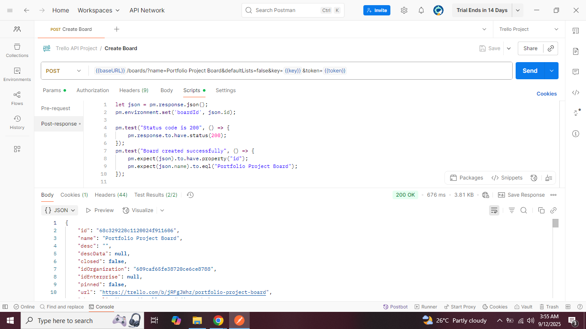
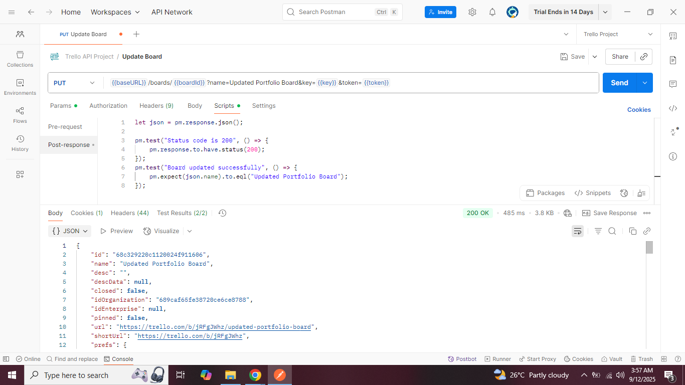
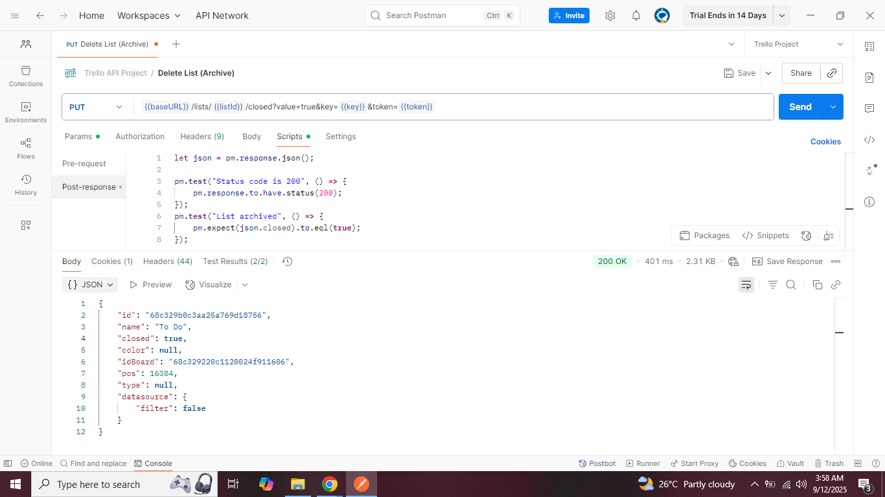
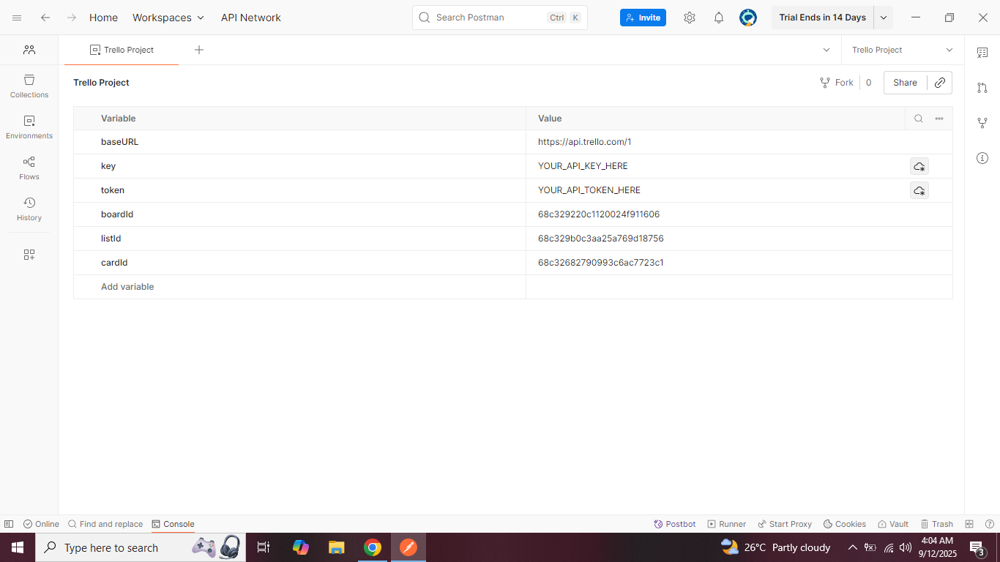
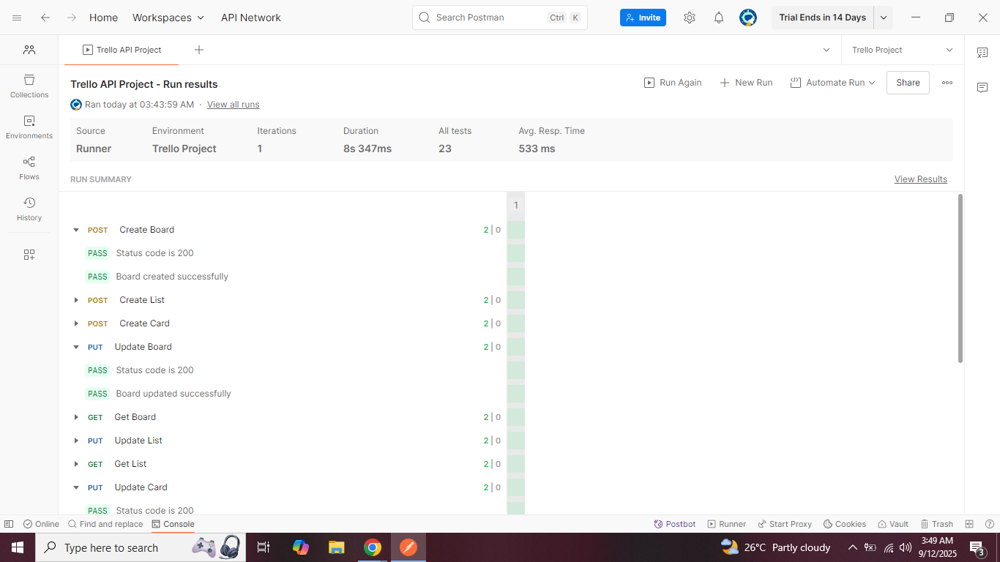
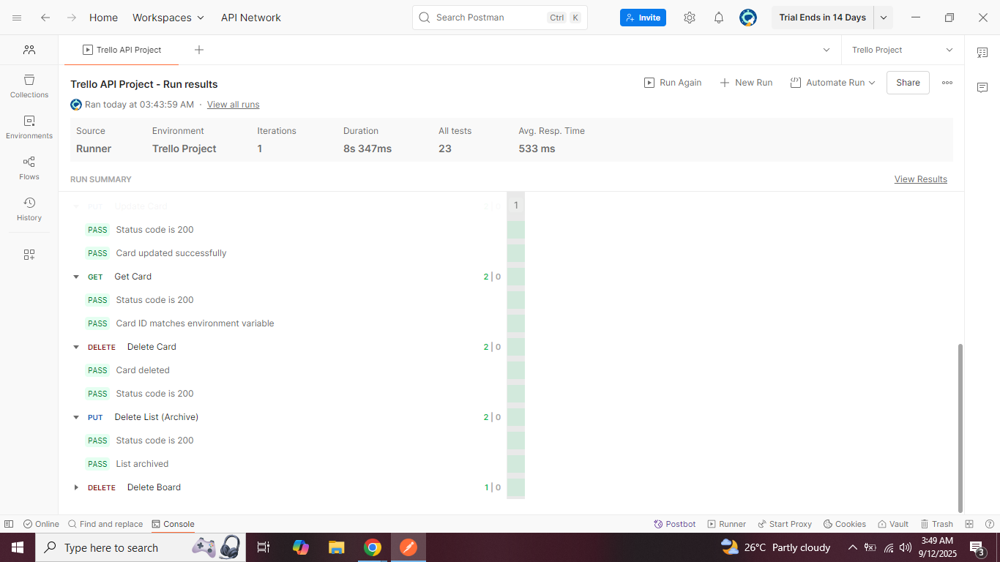

# Trello API Testing with Postman

This project demonstrates API testing using Postman on Trello’s REST API.  
It covers the full CRUD workflow (Board → List → Card) with assertions and environment variables.  
The project is designed to show practical API testing skills that employers look for.  

---

## 🔹 Features
- ✅ End-to-end CRUD testing  
- ✅ Postman Collection with environment variables  
- ✅ Assertions for:
  - Status codes  
  - Data validation (name & description updates)  
  - Archive checks for lists  
- ✅ Ready-to-run Collection Runner tests  
- ✅ Screenshots and results included  

---

## 🔹 API Workflow
1. Create Board  
2. Create List  
3. Create Card  
4. Update Board  
5. Get Board  
6. Update List  
7. Get List  
8. Update Card  
9. Get Card  
10. Delete Card  
11. Delete List  
12. Delete Board  

---

## 🔹 Setup Instructions
1. Clone or download this repo  
2. Import `Trello.postman_collection.json` into Postman  
3. Import `Trello.postman_environment.json` into Postman  
4. Open the environment and replace `YOUR_API_KEY_HERE` and `YOUR_TOKEN_HERE` with your Trello credentials  
5. Run the collection using Postman’s **Collection Runner**  

---

## 🔹 Example Tests
- Response status code is `200`  
- Data is updated correctly (board/list/card names)  
- List is archived successfully  

---

## 🔹 Screenshots

### Create Board

### Update Board

### Archive List

### Environment Variables

### Collection Runner Result 1

### Collection Runner Result 2

---

## 🔹 Priject Value
This project demonstrates API testing skills using Postman and Trello REST APIs.  
It highlights CRUD testing, assertions, environment management, and reporting — all of which are core skills for QA and API testers.  
